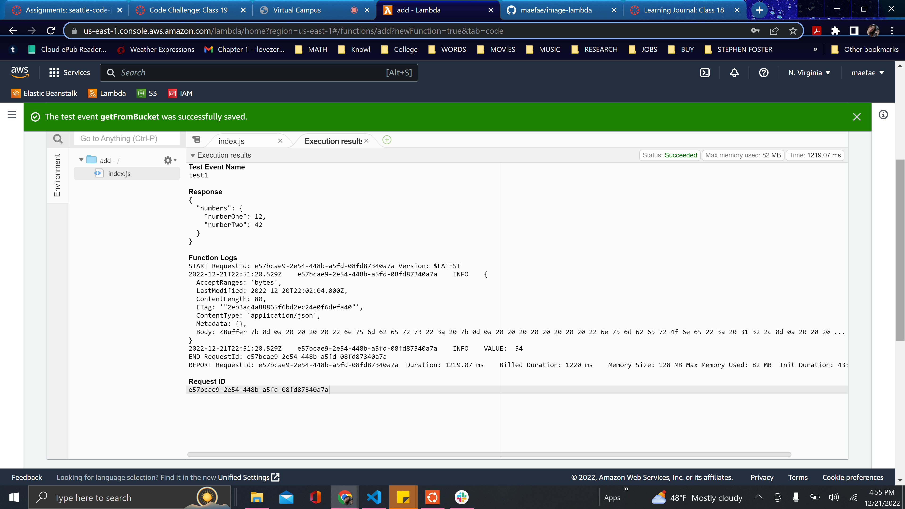

# Class 401 - lab 17: image-lambda 

## Featured Tasks
- To create an S3 bucket with "open" read permissions so that anyone may have the opportunity to view images/files in their browser. 
 
- A user should be able to upoad an image at any size, and update a ditionary of all images that have been uploaded

- As soon as an image is uploaded to the S3 bucket, it should trigger a lambda function that downloads an "images.json" file from the S3 bucket. 

- images.json should be an array of objects that represent an image

- create an empty array if this file is not present 

- create a metadata object describing the image Name, Size, Type, etc.

- Append the data for this image to the array

- Upload the images.json file back to the S3 bucket

## How far I got
I got to the point where I was able to create the bucket. It was right before triggering the lambda function that downloads an images.json file.

## Problems Occured:
Just got lost while trying to follow along in class. I want to gather more
familiarization on what I'm doing and why.

## Links and pictures

